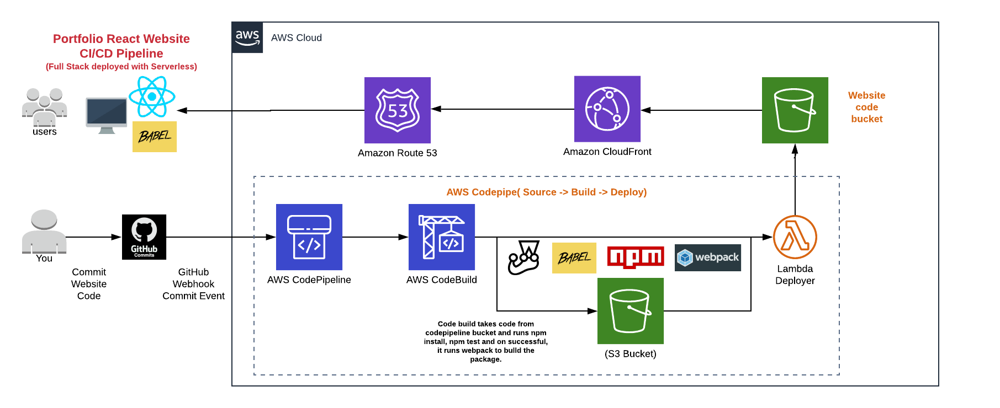

# MyPortfolio-ReactJS-AWS-CICD
This project aimed to create my portfolio website using ReactJS on AWS Serverless along with fully automated CI/CD process.

- Build MyPortfolio Website with ReactJS/Babel
- Test Website with Chai and Mocha.
- Build website code package with webpack.
- Test website with Jest.
- CI/CD Pipeline for automatic deployment.
- Cloud Front distribution along with SSL.
- Route53 setup for URL.

#Website enhancement in progress.

